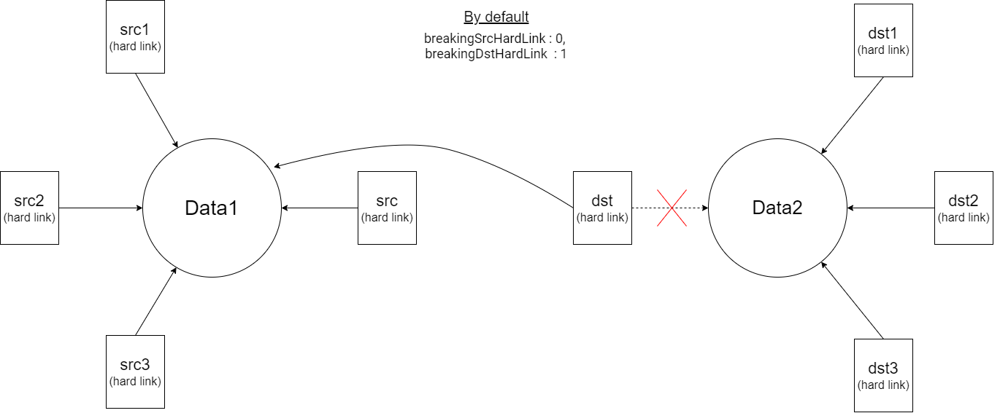
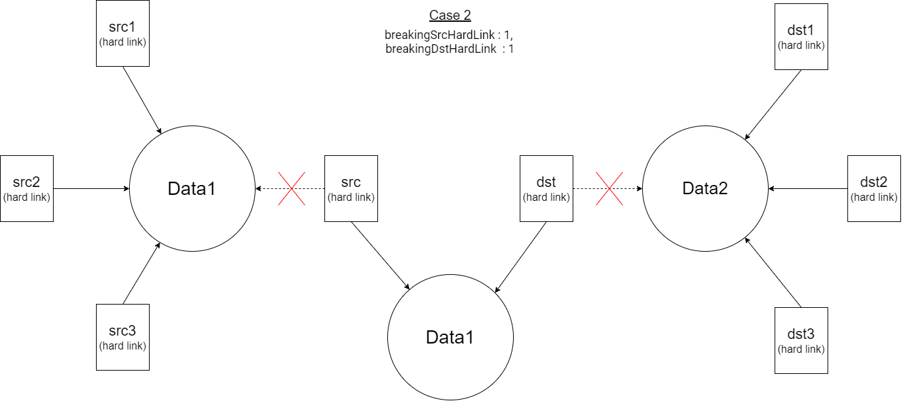

# Базове використання `hardLink`

Використання базових можливостей методу <code>hardLink</code>.

### Застосування рутини `hardLink` до файлів, які уже є хард лінками.

Нехай маємо таку структуру файлів у файловій системі.

У випадку створення хард лінка із опціями за замовчуванням відбудуться наступні зміни:

Файл dst стає хард лінком файла з даними Data1.

У випадку створення хард лінка із опціями breakingSrcHardLink:1 та breakingDstHardLink:0, отримаємо: 

Тобто не лише src стає хард лінком файла на котрий вказував і далі продовжує вказувати хард лінк dst, але й відбувається копіювання даних Data1. Дані Data2 видалені.

Якщо ж встановити опції breakingSrcHardLink:1, breakingDstHardLink:1, отримаємо:

У цьому разі створюється новий файл на котрий вказують хард лінк src та dst. Дані у цей файл копіюються із файлу на який раніше вказував src.

Створення хард лінка з опціями breakingSrcHardLink:0, breakingDstHardLink:0 є забороненим.

### Застосування рутини `hardLink` до файлів, які є софт лінками.

У таблиці нижче наведені всі можливі очікувані результати виконання `hardLink` у випадку коли `src` та/або `dst` файли є софт лінками.

|Return|src is a soft link to|dst is a soft link to|throwing|resolvingSrcSoftLink|resolvingDstSoftLink|allowingMissed|allowingCycled|
|:----:|:-------------------:|:-------------------:|:------:|:------------------:|:------------------:|:------------:|:------------:|
|null  |nonexistent file     |terminal/not exists  |0       |d                   |d                   |1             |1             |
|error |nonexistent file     |terminal/not exists  |1       |d                   |d                   |1             |1             |
|null  |nonexistent file     |terminal/not exists  |0       |0                   |d                   |1             |1             |
|error |nonexistent file     |terminal/not exists  |1       |0                   |d                   |1             |1             |
|null  |nonexistent file     |terminal/not exists  |0       |1                   |d                   |1             |1             |
|error |nonexistent file     |terminal/not exists  |1       |1                   |d                   |1             |1             |
|null  |existing file        |terminal/not exists  |0       |0                   |d                   |1             |1             |
|error |existing file        |terminal/not exists  |1       |0                   |d                   |1             |1             |
|True  |existing file        |terminal/not exists  |d       |1                   |d                   |1             |1             |
|null  |self                 |terminal/not exists  |0       |d                   |d                   |1             |1             |
|error |self                 |terminal/not exists  |1       |d                   |d                   |1             |1             |
|null  |self                 |terminal/not exists  |0       |0                   |d                   |1             |1             |
|error |self                 |terminal/not exists  |1       |0                   |d                   |1             |1             |
|null  |self                 |terminal/not exists  |0       |1                   |d                   |1             |1             |
|error |self                 |terminal/not exists  |1       |1                   |d                   |1             |1             |
|||||||||
|True  |terminal file        |nonexistent file     |0       |d                   |d                   |1             |1             |
|True  |terminal file        |nonexistent file     |0       |d                   |0                   |1             |1             |
|True  |terminal file        |nonexistent file     |0       |d                   |1                   |1             |1             |
|True  |terminal file        |existing file        |0       |d                   |d                   |0             |0             |
|True  |terminal file        |existing file        |0       |d                   |0                   |0             |0             |
|True  |terminal file        |existing file        |0       |d                   |1                   |0             |0             |
|True  |terminal file        |self                 |0       |d                   |d                   |1             |1             |
|True  |terminal file        |self                 |0       |d                   |0                   |1             |1             |
|True  |terminal file        |self                 |0       |d                   |1                   |1             |1             |
|null  |terminal file        |nonexistent file     |0       |d                   |d                   |0             |1             |
|null  |terminal file        |nonexistent file     |0       |d                   |0                   |0             |1             |
|null  |terminal file        |nonexistent file     |0       |d                   |1                   |0             |1             |
|null  |terminal file        |self                 |0       |d                   |d                   |1             |0             |
|null  |terminal file        |self                 |0       |d                   |0                   |1             |0             |
|null  |terminal file        |self                 |0       |d                   |1                   |1             |0             |

Для більшої зрозумілості всі випадки розділено на дві групи. Спочатку лише `src` є софт лінком, а `dst` термінальний файл або не існує (розгляд опції `resolvingDstSoftLink` немає сенсу). Потім `src` є термінальним файлом (розгляд опції `resolvingSrcSoftLink` немає сенсу), а `dst` софт лінком.